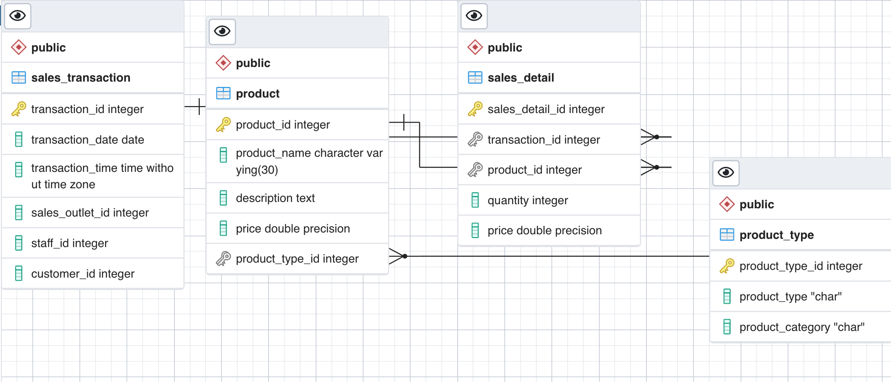
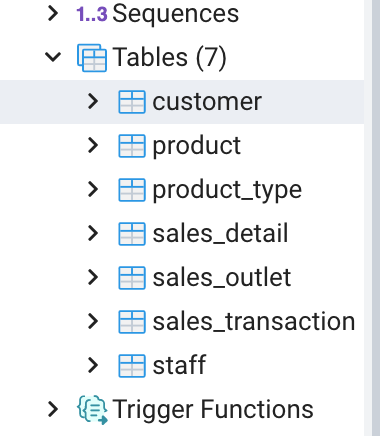
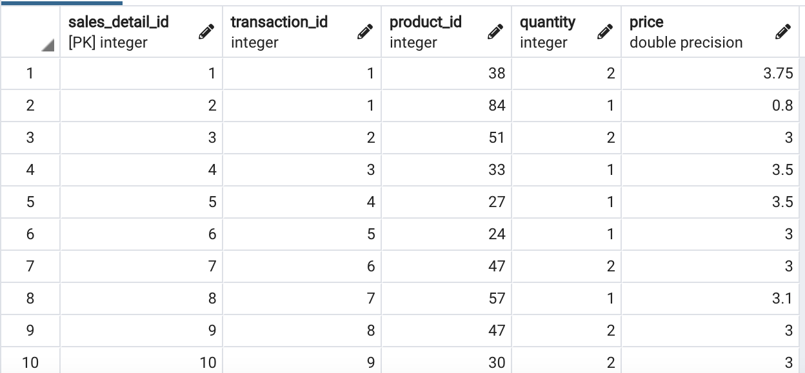
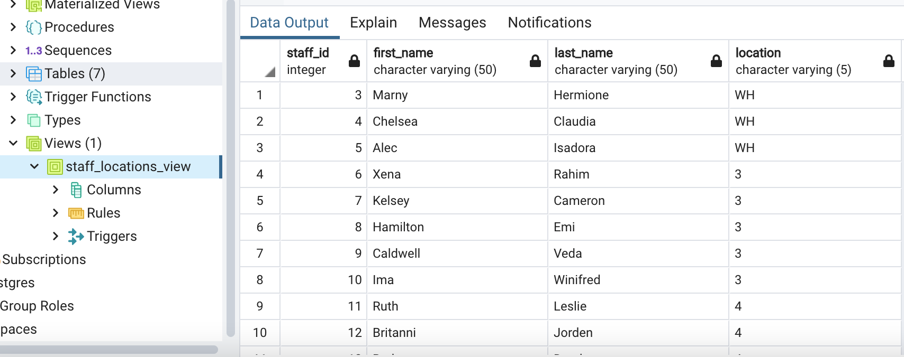
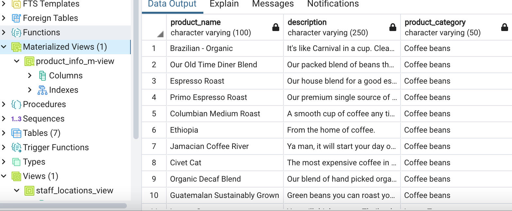
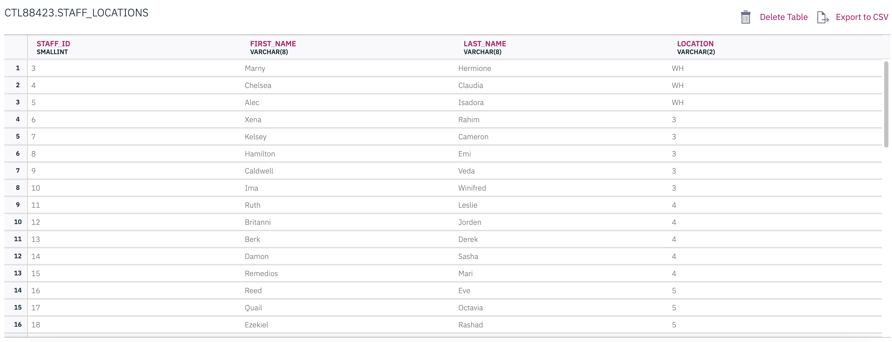
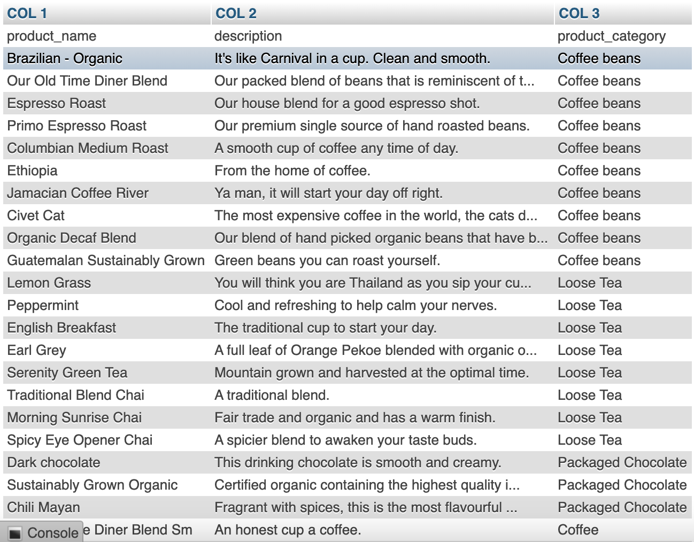

# ibm-data-modeling

## Identify entities:

## Create an ERD using the pgAdmin ERD Tool:

## Normalize tables:

## Define keys and relationships:

## Create database objects by generating and running the SQL script from the ERD Tool:

## Create a view and export the data:

## Create a materialized view and export the data:

## Import data into a Db2 database:

## Import data into a MySQL database:

