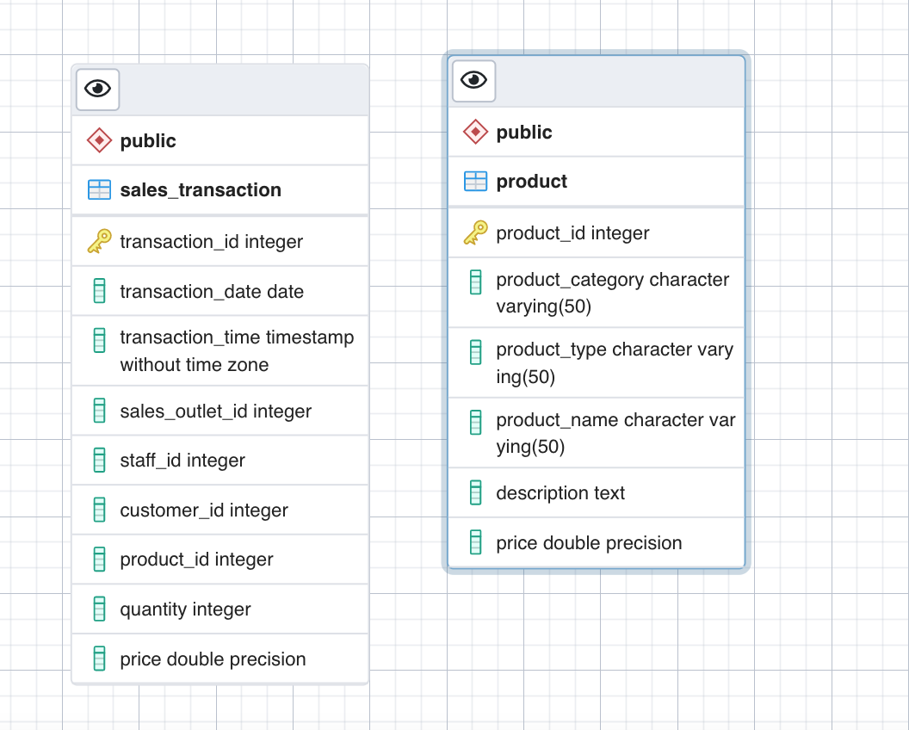
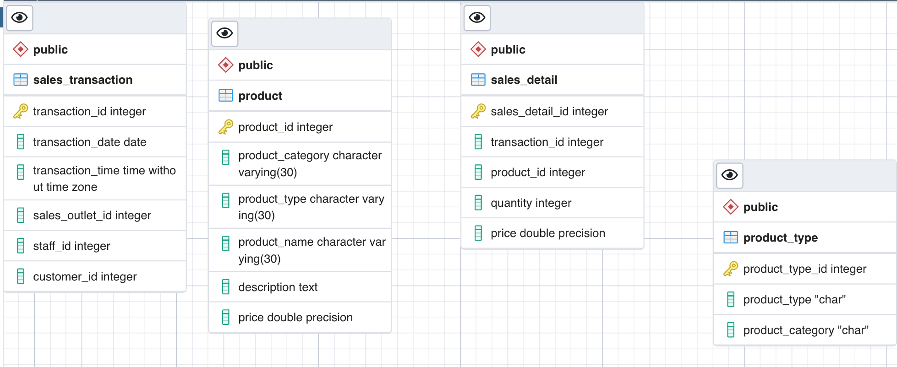

# ibm-data-modeling

## Create an ERD using the pgAdmin ERD Tool:

## Create an ERD using the pgAdmin ERD Tool:

## Create an ERD using the pgAdmin ERD Tool:

## Create an ERD using the pgAdmin ERD Tool:

## Create an ERD using the pgAdmin ERD Tool:

## Create an ERD using the pgAdmin ERD Tool:

## Create an ERD using the pgAdmin ERD Tool:

## Create an ERD using the pgAdmin ERD Tool:

## Create an ERD using the pgAdmin ERD Tool:

## Create an ERD using the pgAdmin ERD Tool:
