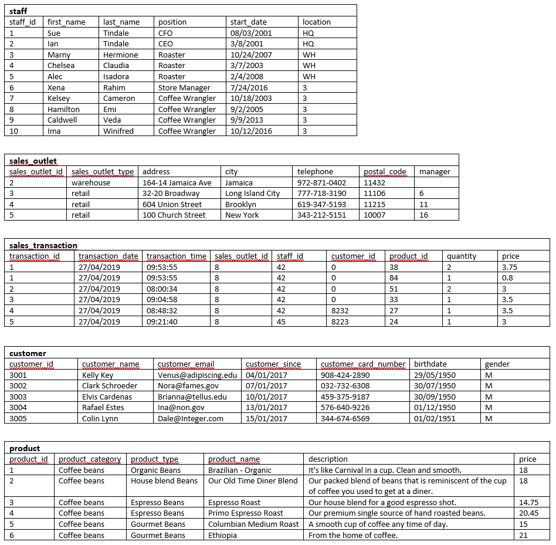

# Data Modeling

## Scenario:

**You have recently been hired as a Data Engineer by a New York based coffee shop chain that is looking to expand nationally by opening a number of franchise locations. As part of their expansion process, they want to streamline operations and revamp their data infrastructure.**

Your job is to design their relational database systems for improved operational efficiencies and to make it easier for their executives to make data driven decisions.

## Identify entities:

## Create an ERD using the pgAdmin ERD Tool:

## Normalize tables:

## Define keys and relationships:

## Create database objects by generating and running the SQL script from the ERD Tool:

## Create a view and export the data:

## Create a materialized view and export the data:

## Import data into a Db2 database:

